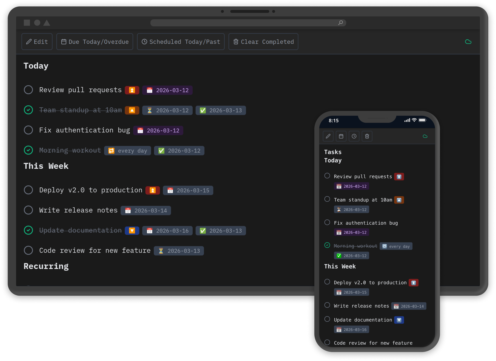

# Schorl

A mobile-first task management app that uses plain text and the Obsidian Tasks markdown syntax. I built this for one user's needs: my own. I LOVE Obsidian and its task plugins, but it's too heavy for quick, ephemeral tasks, like a grocery list you'd traditionally put on paper.

> Disclaimer: 95% of this tool was generated with LLMs. If that turns you off, read no further.



## Motivation

Task management apps often lock your data in proprietary formats or require constant internet connectivity. Schorl takes a different approach: your tasks are stored as plain markdown text using the well-documented [Obsidian Tasks](https://publish.obsidian.md/tasks/) syntax. 

The goal is simple: a fast, clean mobile interface for managing tasks that respects the principle of data ownership.

## Prior Art

This project builds on established tools and conventions:

- **[Obsidian Tasks](https://github.com/obsidian-tasks-group/obsidian-tasks)** - The syntax standard for task metadata (due dates, recurrence, priorities)
- **Plain text task management** - Inspired by todo.txt, Taskwarrior, and other text-based systems
- **Markdown-first** - Following the philosophy that your notes and tasks should be readable without special software

## Features

- **Obsidian Tasks syntax** - Full support for due dates, scheduled dates, recurrence patterns, and priorities
- **Mobile-optimized** - Built with React Native for iOS and web, with a focus on touch interfaces
- **Edit and Read modes** - Switch between raw markdown editing and a rendered task view
- **Smart task creation** - Type `@` on any task line to quickly add dates
- **Recurring tasks** - Automatic generation of next instances when you complete repeating tasks
- **Local-first** - Everything works offline, data stored on your device

Built for iOS and web (Linux) with a monospace, dark-themed interface.

## Tech Stack

- **[Expo](https://expo.dev)** - React Native framework for building cross-platform apps
- **Storage abstraction layer** - Clean interface (`StorageAPI`) designed to be swappable
  - **AsyncStorage** - Local-first offline persistence
  - **[Supabase](https://supabase.com)** - Cloud sync and authentication (optional)
  - Architecture allows easy replacement with other backends (Firebase, self-hosted, etc.)

## Getting Started

```bash
# Install dependencies
npm install

# Start development server
npm start
```

## Installing on iOS (Progressive Web App)

Until native iOS builds are available, install Schorl as a Progressive Web App for a native-like experience:

1. **Open in Safari** (required for iOS PWA support)
   - Navigate to your deployment URL
   
2. **Add to Home Screen**
   - Tap the Share button (□↑) at the bottom
   - Select "Add to Home Screen"
   - Tap "Add"

3. **Launch from your home screen**
   - Opens in standalone mode without browser chrome
   - Works offline with local storage
   - Optional cloud sync via email OTP authentication

**Note:** iOS PWAs work reliably for this app but have some limitations (no push notifications, less background time). Native builds coming soon(?)


## License

MIT

---

AID Statement: Artificial Intelligence Tools: Anthropic models, OpenAI models via various tools. Execution: Generated the vast majority of code. Generated placeholder icons. 